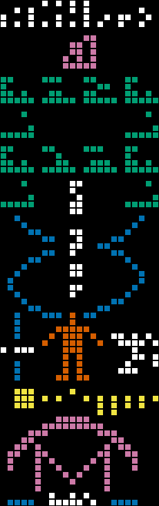

# modern-arecibo

Generate images of the Arecibo message with a user-provided population and genome size.

```
Usage: modern-arecibo [OPTIONS]

Options:
      --population <POPULATION>  The number of humans. Default is the value used in the original 1974 message [default: 4292853750]
      --genome <GENOME>          The number of base pairs in the haploid human reference genome. Default is the value used in the original 1974 message [default: 4294441822]
      --output <OUTPUT>          Output filename [default: arecibo.png]
      --highlight-genome         Highlight the component that represents the human genome size
      --highlight-population     Highlight the component that represents the human population size
      --pluto-is-not-a-planet    Only depict the first eight planets in the solar system
      --scale <SCALE>            The size of each block, in pixels [default: 10]
  -h, --help                     Print help
  -V, --version                  Print version
```



### Why?

In 1974, a group of scientists broadcast a message towards Globular Cluster Messier 13 with the Arecibo telescope. The message was crafted in such a way that any aliens receiving it would potentially be able to understand some basic information about humanity. The message encodes several numerical values, one of which was inaccurate in retrospect. This tools regenerates the message with updated values. See [this blog post](https://www.rybarski.com/arecibo/) for details.

### Installation

`cargo install modern-arecibo`

### Build

```bash
git clone https://github.com/jimrybarski/modern-arecibo
cargo build --release
```

### Examples

Generate the original 1974 message:  

```bash
modern-arecibo --output "arecibo-original.png"
```

Generate the message if it were being sent on February 1st, 2025:

```bash
modern-arecibo --output "arecibo-modern.png" --population 8098171861 --genome 3117275501
```

Deny the existence of Pluto:

```bash
modern-arecibo --output "arecibo-modern-no-pluto.png" --population 8098171861 --genome 3117275501 --pluto-is-not-a-planet
```
